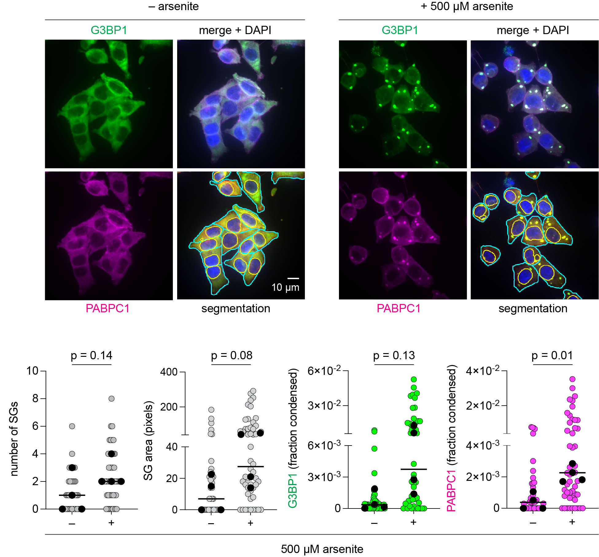
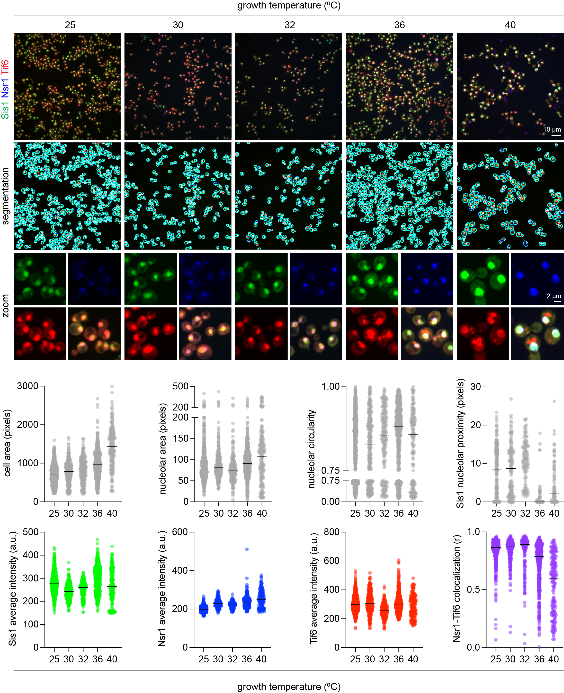

# A Vibecoder's Guide to Image Analysis (AVCGTIA)

**Quantitative fluorescence microscopy for biologists who don't code.**

`cellquant.py` is a single-script pipeline for segmenting cells, counting puncta, measuring colocalization, and computing spatial relationships in multi-channel fluorescence images. You configure it entirely through command-line arguments — no Python editing required. Pair it with an AI assistant (Claude, ChatGPT, etc.) to translate your biology into the right command.

📄 **Publication:** [link to JCB paper when published]

## Quick start

```bash
# 1. Set up the environment
conda env create -f environment.yml
conda activate cellquant

# 2. Run on the example mammalian data
python cellquant.py example_data/mammalian_SGs/ \
  "1:DAPI:nucleus" "2:G3BP1:quantify" "3:PABPC1:quantify" \
  --cell-type mammalian \
  --out example_data/mammalian_SGs/my_output/ \
  --filename-pattern "MAX_{condition}_rep{replicate}"

# 3. Check the QC overlays in my_output/qc/
# 4. Find your data in my_output/cells.csv
```

## What it does

Given a folder of multi-channel TIFF maximum intensity projections, `cellquant.py`:

- **Segments cells** using Cellpose with organism-specific presets
- **Segments nuclei** (optional, from DAPI or similar stain)
- **Segments nucleoli** (optional, from nucleolar markers)
- **Detects puncta** via Laplacian-of-Gaussian in any channel
- **Computes per-cell metrics**: puncta count, area, intensity, fraction condensed
- **Measures colocalization**: Pearson's R and Manders' coefficients with Costes thresholding
- **Measures spatial proximity**: distance from puncta to nucleolar boundary
- **Quantifies nucleolar morphology**: area, solidity, circularity, eccentricity
- **Generates QC overlays** for visual validation
- **Produces superplots** with replicate-level statistics
- **Exports Prism-ready CSVs** for further analysis

## Channel syntax

Tell the pipeline what each channel is and what to do with it:

```
"position:Name:role"
```

Roles: `nucleus` | `quantify` | `nucleolus` | `cell-boundary` | `skip`

Examples:
```bash
# Mammalian cells with DAPI + two markers
"1:DAPI:nucleus" "2:G3BP1:quantify" "3:PABPC1:quantify"

# Yeast with nucleolar marker + two proteins of interest
"1:Tif6:quantify" "2:Nsr1:nucleolus" "3:Sis1:quantify"

# Four-channel with one channel to ignore
"1:DAPI:nucleus" "2:GFP:quantify" "3:RFP:quantify" "4:BF:skip"
```

## Cell-type presets

```bash
--cell-type mammalian   # Large cells, 3x downsampling, nuclear segmentation
--cell-type yeast       # Small cells, no downsampling, area filtering
--cell-type bacteria    # Tiny cells, specialized parameters
```

All preset values can be overridden: `--cell-type yeast --cell-diameter 50`

## Tutorials

| Tutorial | System | What you'll learn |
|----------|--------|-------------------|
| [Tutorial 1: Mammalian stress granules](docs/TUTORIAL_1_mammalian_SGs.md) | U2OS ± arsenite | Basics: install, run, interpret, statistics |
| [Tutorial 2: Yeast temperature series](docs/TUTORIAL_2_yeast_temp.md) | Yeast 25–40°C | Advanced: colocalization, proximity, morphology |

## Documentation

- [Installation guide](docs/INSTALL.md) — step-by-step setup for Mac/Windows/Linux
- [Quick start](docs/QUICKSTART.md) — run something in 5 minutes
- [CLI reference](docs/CLI_REFERENCE.md) — every flag, explained
- [Troubleshooting](docs/TROUBLESHOOTING.md) — Apple Silicon, common errors, FAQ
- [Philosophy](docs/PHILOSOPHY.md) — why we built it this way

## Example output

### Mammalian stress granules (U2OS ± arsenite)


### Yeast temperature series (25–40°C)


## Requirements

- Python 3.11+
- Cellpose 4.x
- scikit-image, numpy, pandas, matplotlib, scipy, PyYAML, tifffile

See [environment.yml](environment.yml) for exact versions.

## How to ask an AI for help

The whole point of this tool is that you can use an AI assistant to figure out the right command. Here are some example prompts:

> "I have 4-channel TIFF images of HeLa cells. Channel 1 is DAPI, channel 2 is a GFP-tagged protein that forms foci under stress, channel 3 is an RFP nuclear marker, and channel 4 is brightfield which I want to ignore. How do I run cellquant?"

> "My yeast cells are being split in half by the segmentation. How do I fix this?"

> "I want to know if my protein of interest colocalizes with a nucleolar marker. What flags should I add?"

## Citation

If you use `cellquant` in your research, please cite:

> Pincus D, Khokhani A, Ali A. A Vibecoder's Guide to Image Analysis: Accessible Quantitative Microscopy Through AI-Assisted Command-Line Pipelines. *Journal of Cell Biology*. 2026. [DOI]

## License

MIT License. See [LICENSE](LICENSE) for details.
