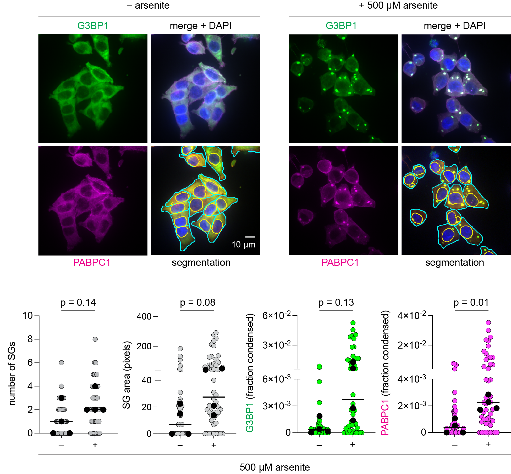
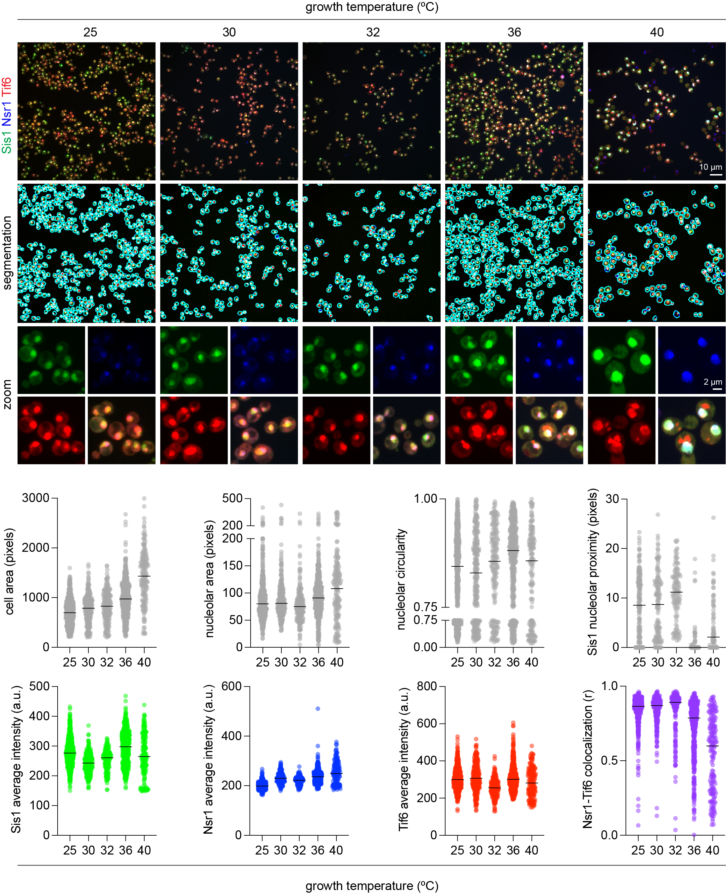

# Cellquant: a vibecoder's guide to image analysis

**Quantitative fluorescence microscopy for biologists who don't code.**

[](https://github.com/davidpincus/cellquant/actions/workflows/tests.yml)
[](LICENSE)
[](https://www.python.org/)

<https://github.com/davidpincus/cellquant>

`cellquant.py` is a single-script pipeline for segmenting cells, counting puncta, measuring colocalization, and computing spatial relationships in multi-channel fluorescence images — in **2D or natively in 3D**. You configure it entirely through command-line arguments — no Python editing required. Pair it with an AI assistant (Claude, ChatGPT, etc.) to translate your biology into the right command.

## Quick start

> **Never opened a terminal?** Start with the [installation guide](docs/INSTALL.md)
> instead — it assumes no prior terminal experience and walks through every step for
> Mac, Windows and Linux. Come back here once `cellquant.py --help` prints something.

```bash
# 1. Set up the environment (pick one)
uv run cellquant.py --help            # option A: uv (recommended, installs on first run)

# OR: conda
conda env create -f environment.yml
conda activate cellquant

# OR: pip-only (no conda needed)
python3.11 -m venv cellquant_env && source cellquant_env/bin/activate
pip install -r requirements.txt

# 2. Run on the example mammalian data
python cellquant.py example_data/mammalian_SGs/ \
  "1:DAPI:nucleus" "2:G3BP1:quantify" "3:PABPC1:quantify" \
  --cell-type mammalian \
  --out example_data/mammalian_SGs/my_output/ \
  --filename-pattern "MAX_{condition}_rep{replicate}"

# 3. Check the QC overlays in my_output/qc/
# 4. Find your data in my_output/cells.csv
```

## What it does

Given a folder of multi-channel TIFFs — projections or z-stacks — `cellquant.py`:

- **Segments cells** using Cellpose with organism-specific presets
- **Segments nuclei** (optional, from DAPI or similar stain)
- **Segments nucleoli** (optional, from nucleolar markers)
- **Detects puncta** via Laplacian-of-Gaussian in any channel
- **Computes per-cell metrics**: puncta count, size, intensity, fraction condensed, fragmentation
- **Measures colocalization**: Pearson's R and Manders' coefficients with Costes thresholding — natively in 3D. On projections this is **refused by default**, because collapsing Z inflates apparent overlap; `--allow-2d-colocalization` forces it and stamps the output `projection_derived=True`
- **Measures spatial proximity**: distance from puncta to nucleolar boundary
- **Quantifies nucleolar morphology**: area, solidity, circularity and eccentricity in 2D; volume and equivalent diameter in 3D. The 2D shape descriptors have no 3D counterpart — they describe the outline of a projected shadow, and the 3D equivalents (sphericity, surface area) are not reliably measurable at typical axial sampling, so they are deliberately not reported
- **Generates QC overlays** for visual validation
- **Produces superplots** with replicate-level statistics
- **Exports Prism-ready CSVs** for further analysis

## 2D or 3D

cellquant decides from the shape of your first image and says so at startup. A folder of projections runs the 2D pipeline; a folder of z-stacks runs natively in 3D — same CLI, same output files, with areas replaced by volumes. Force it with `--mode {auto,2d,3d}`, or flatten stacks yourself with `--project-z max`.

The example data includes a z-stack pair, so this runs on a fresh clone:

```bash
python cellquant.py example_data/yeast_3d/ \
  "1:Tif6:quantify" "2:Nsr1:nucleolus" "3:Sis1:quantify" \
  --cell-type yeast \
  --out results_3d/ \
  --seg-downsample 2 \
  --puncta-channels Tif6 Sis1 \
  --colocalization \
  --nucleolar-proximity Nsr1 \
  --filename-pattern "{condition}_rep{replicate}"
```

Note there is no `--voxel-size`: those files are OME-TIFFs carrying their own voxel size, and cellquant reads it. **In 3D a voxel size is not optional.** Every volume, every micron distance, and the anisotropy correction on the puncta filter depend on it, so if cellquant finds neither metadata nor `--voxel-size XY_UM Z_UM` it aborts rather than assuming 1 µm cubes. When you do supply it, pass **both** values, lateral first. See [PHILOSOPHY](docs/PHILOSOPHY.md) for why refusing is the better default.

## Where measurements are made

Puncta are detected inside a region, not the whole image — `--puncta-compartment` (default `cytosol`; `whole-cell` under the yeast preset). Beyond the built-ins `whole-cell`, `cell`, `nucleus`, `cytosol` and `nucleolus`, you can define your own by set algebra and use the name anywhere a region is accepted:

```bash
--compartment "perinuc = cell - nucleolus" --puncta-compartment perinuc
```

Operators are applied strictly left to right and **need surrounding spaces** — `cell - nucleolus` parses, `cell-nucleolus` does not. Each region you define adds a size column and a `{channel}_{NAME}_mean` column per channel to `cells.csv`.

A term can also be grown or shrunk by a distance: `nucleolus~0.3` grows it by 0.3 µm, `~-0.3` shrinks it. Because that distance is in microns, it requires a known pixel size — on images without one the run aborts rather than silently applying it in pixels, so pass `--voxel-size XY_UM` alongside it. Full grammar in the [CLI reference](docs/CLI_REFERENCE.md).

## Channel syntax

Tell the pipeline what each channel is and what to do with it:

```
"position:Name:role"
```

Roles: `nucleus` | `quantify` | `nucleolus` | `cell-boundary` | `skip`

Examples:
```bash
# Mammalian cells with DAPI + two markers
"1:DAPI:nucleus" "2:G3BP1:quantify" "3:PABPC1:quantify"

# Yeast with nucleolar marker + two proteins of interest
"1:Tif6:quantify" "2:Nsr1:nucleolus" "3:Sis1:quantify"

# Four-channel with one channel to ignore
"1:DAPI:nucleus" "2:GFP:quantify" "3:RFP:quantify" "4:BF:skip"
```

## Cell-type presets

```bash
--cell-type mammalian   # Large cells, 3x downsampling, nuclear segmentation
--cell-type yeast       # Small cells, no downsampling, area filtering
--cell-type bacteria    # Tiny cells, specialized parameters
```

All preset values can be overridden: `--cell-type yeast --cell-diameter 50`

## Tutorials

| Tutorial | System | What you'll learn |
|----------|--------|-------------------|
| [Tutorial 1: Mammalian stress granules](docs/TUTORIAL_1_mammalian_SGs.md) | HCT116 ± arsenite | Basics: install, run, interpret, statistics |
| [Tutorial 2: Yeast temperature series](docs/TUTORIAL_2_yeast_temp.md) | Yeast 25–40°C | Advanced: colocalization, proximity, morphology |
| [Tutorial 3: Four-condition dose-response](docs/TUTORIAL_3_four_condition.md) | Arsenite at 4 concentrations — **your own data** | Multi-condition designs, positive/negative controls, Bonferroni-corrected pairwise tests |

Tutorials 1 and 2 run on data included in the repository. Tutorial 3 is a template for an experiment of your own — no dose-response dataset ships with cellquant. [Tutorial 2 ends with a 3D section](docs/TUTORIAL_2_yeast_temp.md#step-8-the-same-experiment-in-3d) that repeats the same experiment on z-stacks.

## Documentation

- [Installation guide](docs/INSTALL.md) — step-by-step setup for Mac/Windows/Linux (uv recommended, conda alternative)
- [Quick start](docs/QUICKSTART.md) — run something in 5 minutes
- [CLI reference](docs/CLI_REFERENCE.md) — every flag, explained
- [Concepts](docs/CONCEPTS.md) — plain-language guide to what each measurement means and when it can mislead
- [Troubleshooting](docs/TROUBLESHOOTING.md) — Apple Silicon, common errors, FAQ
- [Philosophy](docs/PHILOSOPHY.md) — why we built it this way
- [Changelog](CHANGELOG.md) — what changed in each release
- [Contributing](CONTRIBUTING.md) — reporting problems and proposing changes

## Example output

### Mammalian stress granules (HCT116 ± arsenite)


### Yeast temperature series (25–40°C)


## Requirements

- Python 3.11 or 3.12 (3.13 is not supported — Cellpose/PyTorch wheels and the `numpy<2.0` pin)
- Cellpose 4.x
- scikit-image, numpy, pandas, matplotlib, scipy, PyYAML, tifffile

See [environment.yml](environment.yml) or [requirements.txt](requirements.txt) for exact versions.

## Tests

```bash
pytest
```

The suite runs the full pipeline on the cropped datasets in `example_data/` and checks that
the expected output files and columns appear — about a minute. It deliberately does not
assert exact numeric values, because Cellpose is not deterministic across platforms. CI runs
the same suite on Linux and macOS across Python 3.11 and 3.12.

## How to ask an AI for help

The whole point of this tool is that you can use an AI assistant to figure out the right command. Here are some example prompts:

> "I have 4-channel TIFF images of HeLa cells. Channel 1 is DAPI, channel 2 is a GFP-tagged protein that forms foci under stress, channel 3 is an RFP nuclear marker, and channel 4 is brightfield which I want to ignore. How do I run cellquant?"

> "My yeast cells are being split in half by the segmentation. How do I fix this?"

> "I want to know if my protein of interest colocalizes with a nucleolar marker. What flags should I add?"

## Citation

If you use `cellquant` in your research, please cite:

> Neferkara A, Chaney Winner L, Ali A, Pincus D. Cellquant: a vibecoder's guide to image analysis. 2026. Submission and DOI pending.

Machine-readable metadata is in [CITATION.cff](CITATION.cff) and [.zenodo.json](.zenodo.json).

## Data availability

The cropped datasets in `example_data/` ship with the repository, so the tutorials and the
test suite run on a fresh clone with nothing to download.

The full raw image data underlying the published figures — 99 multi-channel z-stacks,
about 52.9 GB — is archived on Zenodo at
[10.5281/zenodo.21829810](https://doi.org/10.5281/zenodo.21829810):

- **86 yeast z-stacks**, 6 h at 25, 30, 32, 36 and 40 °C, channels Tif6 / Nsr1 / Sis1
- **6 HCT116 z-stacks** (3 control, 3 sodium arsenite) plus 7 maximum-intensity
  projections, channels DAPI / G3BP1 / PABPC1

You only need it to regenerate the published figures from original data; the harness that
does so is in [`validation_3d/`](validation_3d/).

## Contributing

Bug reports, questions about analyzing your own data, and pull requests are all welcome —
see [CONTRIBUTING.md](CONTRIBUTING.md). If cellquant refused to run with a message about
voxel size or 2D colocalization, that is usually deliberate; check
[TROUBLESHOOTING.md](docs/TROUBLESHOOTING.md) before filing a bug.

## License

MIT License. See [LICENSE](LICENSE) for details.
